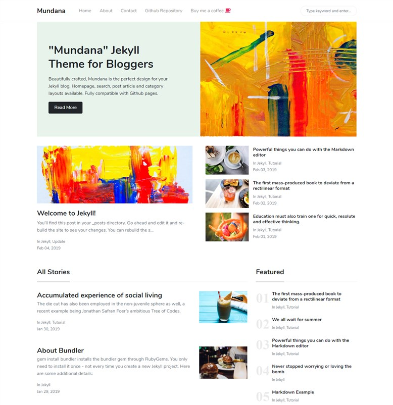

# Jekyll Theme - Mundana by WowThemes.net

### Live Demo

[Live Demo](https://wowthemesnet.github.io/mundana-theme-jekyll/) &nbsp; | &nbsp; 
[Download](https://github.com/wowthemesnet/mundana-theme-jekyll/archive/master.zip) &nbsp; | &nbsp; 
[Buy me a coffe](https://wowthemesnet.github.io/mundana-theme-jekyll//buy-me-a-coffee.html)



### Install Mundana

- [Download](https://github.com/wowthemesnet/mundana-theme-jekyll/archive/master.zip) or `git clone https://github.com/wowthemesnet/mundana-theme-jekyll.git`
- In Mundana's newly created directory `bundle`
- Change your configuration in `_config.yml`. If your site is in root, for `baseurl`, make sure this is set to `baseurl: ''`

### Use

**YAML Post Example**:

```
---
layout: post
title:  "We all wait for summer"
author: john
categories: [ Jekyll, tutorial ]
image: assets/images/5.jpg
---
```

`comments: false` - disable comments in posts

`image: "https://www.myexternal.com/image.jpg"`  - set external featured image

`tags: [featured]` - to display Featured posts on homepage


**YAML Page Example**:

```
---
title: "About"
permalink: "/about.html"
image: "/assets/images/screenshot.jpg"
---
```

### Contribute

- [Clone the repo](https://github.com/wowthemesnet/mundana-theme-jekyll).
- Create a branch off of master and give it a meaningful name (e.g. this-new-feature).
- Open a pull request on GitHub and describe the feature or fix.

Thank you so much for your contribution!


### Copyright

Copyright (C) 2019 WowThemes.net.

Theme designed and developed by [Sal](https://www.wowthemes.net), *free* under MIT license. 

<a href="https://wowthemesnet.github.io/mundana-theme-jekyll//buy-me-a-coffee.html" target="_blank"></a>

### Live Demo

[Live Demo](https://wowthemesnet.github.io/mundana-theme-jekyll/)