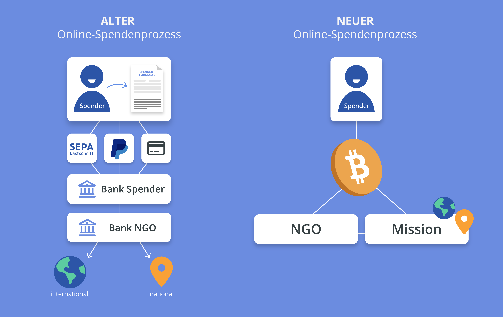
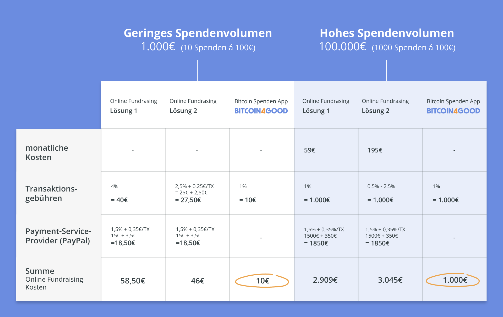

Im zurückliegenden Jahr habe ich so viele Fundraising- und NGO Veranstaltungen besucht, wie in keinem der vergangenen 10 Jahre, in denen ich mich nun beruflich im Non-Profit Sektor bewege. Es sind zwei fundamentale Herausforderungen, die dem Sektor organisationsübergreifend Kopfzerbrechen bereiten und deren Effekte immer deutlicher im Alltag zivilgesellschaftlicher Organisationen zu spüren sind.  Zum einen wird der Handlungsspielraum für gemeinnützige Organisationen durch das Erstarken repressiver Strukturen, auch in Deutschland, bedrohlich eingeengt – ein Phänomen, das als "Shrinking Spaces" bezeichnet wird.
Zum anderen erleben wir tiefgreifende wirtschaftliche Herausforderungen im gemeinnützigen Sektor: Während die Anzahl der Spender durch den demografischen Wandel seit Jahren stagniert, steigen gleichzeitig die Kosten für gemeinnützige Organisationen durch anhaltend hohe Inflationsraten. Weiterhin haben die jüngeren Generationen, die es nun anzusprechen gilt, eine ganz eigene, bisher von vielen Organisationen unterschätzte Herangehensweise an das Thema Spenden. Ich möchte im Laufe des Artikels eine technologische Lösung aufzeigen, die beide Herausforderung, so unterschiedlich sie sind, adressiert. Die Rede ist dabei vom Schweizer Taschenmesser der Technologien: Bitcoin. Aber der Reihe nach.

### Shrinking Spaces für die Zivilgesellschaft

Ein Blick in die internationale Landschaft zeigt, was es bedeutet, wenn Freiheit und Handlungsfähigkeit zivilgesellschaftlicher Akteure beschnitten werden. Es wird NGOs zum Beispiel verboten, finanzielle Förderung aus dem Ausland zu beziehen, es werden aufwändige Verwaltungsprozesse eingeführt, welche das Arbeiten langwierig und teuer machen und in den schlimmsten Fällen werden NGO-Mitarbeitende sanktioniert, bedroht, verhaftet oder sogar ermordet.

Setzt sich der aktuell besorgniserregende Trend in den Umfragewerten der AfD fort, dürfte es auch für gemeinnützige Organisationen in Deutschland in den nächsten Jahren ungemütlicher werden. Bereits jetzt werden zivilgesellschaftliche Organisationen diffamiert und ihre Legitimität in [parlamentarischen Anfragen](https://www.deutschlandfunk.de/parlamentarische-anfragen-afd-will-demokratie-vereinen-100.html) öffentlich in Frage gestellt. Repressiven Regierungen ist es ein Leichtes, über zentralisierte Finanzdienstleister durchzugreifen und Zugänge zu Bankkonten, Zahlungsdienstleistern (z.B. Paypal oder Transferwise) oder Spendenplattformen (z.B. Gofundme, Betterplace oder Patreon) zu unterbinden, Gelder einzufrieren und Organisationen damit faktisch handlungsunfähig zu machen. Bitcoin bietet zivilgesellschaftliche Akteure einen nicht konfiszierbaren Rettungsanker, wenn sie vom herkömmlichen Finanzsystem abgeschnitten sind. Organisationen wie Wikileaks, die nigerianische Femininst Coalition oder die Anti-Corruption Foundation von Alexej Nawalny existieren nur noch, weil Bitcoin ihnen als alternative Bank und sicherer Hafen gedient hat. Die genannten, sowie viele weitere Organisationen und Aktivist*innen wären ohne ein dezentrales, nicht korrumpierbares Geld nicht in der Lage gewesen, weiterhin Spenden zu empfangen, diese vor korrupten Regierungen zu schützen und selbst Überweisungen durchzuführen. Bitcoin ist ein finanzielles Asset, das durch seine dezentrale Natur vor Beschlagnahmung und Einfrieren geschützt ist, sodass Mittel und Finanzströme sicher und unangetastet bleiben. Dies macht Bitcoin zu einem unverzichtbaren Werkzeug für gemeinnützige Organisationen, um ihre finanzielle Unabhängigkeit zu wahren und im Zweifelsfall handlungsfähig zu bleiben. Der einfachste Weg für NGOs, Zugang zu Bitcoin zu erhalten, ist die Akzeptanz als Spende. Apropos Spenden.

### Schöne neue Spendenwelt?(!)

Es ist schon lange kein Geheimnis mehr, dass die Auswirkungen des demografischen Wandels auch vor dem Fundraising nicht halt machen. Obwohl das Spendenvolumen noch steigt, geht die Anzahl der einzelnen Spender*innen stetig zurück. Das habe ich bereits vor 5 Jahren in der Einleitung [meiner Masterarbeit](https://sozialmarketing.de/wp-content/uploads/2019/08/Kuenstliche-Intelligenz-im-Fundraising_MA_Stoll_Philipp.pdf) geschrieben, in der ich mich mit den Potenzialen künstlicher Intelligenz für das Fundraising auseinandergesetzt habe. Meine persönliche Meinung hat sich mittlerweile dahingehend geändert, dass das Fundraising nicht einfach versuchen sollte exakt das nachzuahmen, was die For-Profit Marketing Maschinerie bereits seit vielen Jahren macht. Spenderdaten sammeln, verfügbare Metadaten anreichern, Verhaltensmuster analysieren und so versuchen, das Spendenverhalten zu antizipieren, um den möglichst perfekten Kommunikationskanal, mit einer berührenden Message, zu genau dem richtigen Zeitpunkt bespielen zu können. Oder anders ausgedrückt: sich zu institutionalisierten Datenkraken zu entwickeln, die versuchen, dem Spender entlang der Donor Journey vom Interessenten zum Nachlassgeber methodisch jeden Cent aus der Tasche zu ziehen. Abgesehen von der Tatsache, dass ich persönlich es hinsichtlich der Spenderpyramide eher mit Ricarda Raths halte, die in ihrem Vortrag auf dem Fundraisingtag Berlin Brandenburg sagte “Vergesst die Spenderpyramide, Menschen funktionieren nicht linear”, wirft sich mir persönlich mittlerweile eher die Frage auf, ob die Methodik des “gläsernen Spenders “ für eine zivilgesellschaftliche Organisation wirklich die geeignetste ist. Ich möchte weder sagen, dass derartige Maßnahmen keine nützlichen Effekte auf die Spendeneinnahmen der Organisationen haben können, noch möchte ich zum Ausdruck bringen, dass es nicht sinnvoll ist, datengetrieben zu arbeiten. Die Frage lautet eher, ob zivilgesellschaftliche Organisationen nicht einen anderen Anspruch an den Umgang mit der Privatsphäre und Datenhoheit ihrer Spender*innen haben sollten. In einem anderen Vortrag stellt eine Teilnehmende die Frage, ob ihre Organisation überhaupt die Information sammeln dürfe, ob eine Spenderin beispielsweise ein Kind hat. Die Antwort “Nein dürfen sie nicht, aber es gibt Tricks” ist für mich exemplarischer Ausdruck dafür, dass gemeinnützige Organisationen Lösungsansätze wählen, die irgendwie nicht so richtig in die Non-Profit-Welt passen, aber gewählt werden, weil der finanzielle Druck offensichtlich groß ist.

In einer idealen Welt sollten Menschen übrigens so wenig zum Spenden animiert werden müssen, wie sie zum Konsumieren angeregt werden müssen. So, wie uns ein natürliches Bestreben zum Konsumieren auf dem Weg zur individuellen Bedürfnisbefriedigung innewohnt, haben wir Menschen auch den evolutionären Drang zu kooperieren und zu helfen. Manifestiert in Gefühlen wie dem “Helferhoch” sind es diese Fähigkeiten, die das Überleben unserer Spezies überhaupt erst möglich gemacht haben. Helfen und Kooperieren sind zuletzt rein egoistisch getriebene Handlung, denn dem Einzelnen kann es nur gut gehen, wenn es auch seinem Umfeld gut geht. Wenn Organisationen also wirksam sind und positive Veränderungen in den Lebenswelten verschiedener Individuen bewirken, sollte dieser Mehrwert von der Gesellschaft in Form von monetärer Unterstützung wertgeschätzt werden. Leider leben wir nicht in einer idealen Welt, aber ich möchte für eine innovative und technologische Lösung plädieren, um den Herausforderungen der Spendenwelt zu begegnen.

### Ein effizienterer Spendenprozess
Um dem finanziellen Druck durch sinkendes Spendenvolumen entgegenzuwirken, sollten sich Organisationen auch die Frage stellen, ob der Spendenprozess, wie er sich in der Vergangenheit unter gegebenen Umständen entwickelt hat, noch dem technologischen Status quo entspricht. Betrachten wir exemplarisch eine Online-Spende, sind in dem Prozess vom Anbieter des Spendenformulars, einem Payment Service Provider, der Bank spendender Person und der Bank der NGO bereits vier externe Stakeholder involviert, wobei das Geld, noch nicht für die jeweilige Mission eingesetzt wurde, sondern gerade einmal die Organisation erreicht hat. Sind Organisationen global aktiv, bringt der internationale Geldtransfer zusätzliche Herausforderungen mit sich.

Diese Faktoren wirken sich sowohl auf die Reaktionszeit, als auch auf die Kosten aus, die während des Spendenprozesses entstehen. In Krisensituationen wie beispielsweise zu Kriegsbeginn in der Ukraine zeigt sich, dass traditionelle Bankensysteme an ihre Grenzen stoßen. Geld, das dringend benötigt wird, bleibt stecken und erreicht die Hilfsbedürftigen oft nicht rechtzeitig oder gar nicht. Der herkömmliche Spendenprozess ist aufgrund seiner Fragmentiertheit  nicht nur langsam, sondern verursacht auch unnötige Kosten, wie sich beispielhaft an einer Online Spende via Paypal dargestellt auf der folgenden Abbildung entnehmen lässt. Hinzu kommt die Tatsache, dass kleine Spendenbeträge aufgrund der Gebührenstruktur und Fixkosten häufig gar nicht effizient verarbeitbar sind - vor allem nicht im internationalen Kontext.

Bitcoin als Technologie ermöglicht es NGOs ihre monetäre Energie, denn nichts anderes sind eingeworbene Spenden, effizient in die jeweilige Mission zu kanalisieren, indem Mittelsmänner aus dem Prozess genommen und stattdessen die Spender*innen direkt mit der Mission verbunden werden. Finanzielle Hilfe kann so rund um die Uhr, an 365 Tagen im Jahr, global und zu einem Bruchteil der bisherigen Kosten verfügbar gemacht werden.

### Neue Zielgruppen erreichen
Insbesondere bei jüngeren Menschen beobachten wir ein sich wandelndes Spendenverhalten: Statt langfristigen Mitgliedschaften und Dauerspendenversprechen werden vermehrt situationsbedingt kleine Beträge an unterschiedliche Organisationen gespendet. Die Technologie hinter Bitcoin, und hier besonders das Lightning-Netzwerk, ermöglicht genau diese Art von Mikrotransaktionen auf effiziente und kostengünstige Weise abzuwickeln. Etwas, das wie oben beschrieben auf Grund der Struktur des bisherigen Spendenprozesses gar nicht möglich war. Darüber hinaus ermöglicht die Akzeptanz von Bitcoin als Spende eine Internationalisierung von Spendenaktionen. Organisationen können so von der global aktiven und stetig wachsenden Bitcoin-Community unterstützt werden und sind nicht länger auf ihren lokalen Spendenmarkt angewiesen.

### FAZIT
Wollen Organisationen effizient und wirksam in einer digital vernetzten Welt agieren, sollten sie auch das native digitale Geld nutzen, welches ja überhaupt erst für den Zweck, dass es im Internet ohne Zwischeninstanzen funktioniert, kreiert wurde.
Wir haben gesehen, dass Bitcoin gemeinnützigen Organisationen nicht nur eine wertvolle finanzielle Stütze in unsicheren Zeiten bietet, sondern ihnen auch die Möglichkeit, auf sich ändernden Spendenpräferenzen zu reagieren, um so eine breitere Basis an Unterstützer*innen zu erreichen. Die Kombination aus der Fähigkeit, sich vor staatlichen Eingriffen zu schützen, die Effizienz der Geldtransfers zu erhöhen und eine neue Generation von Spendern anzusprechen, macht Bitcoin zu einem unverzichtbaren Werkzeug für NGOs. Der einfache Zugang zu globalen Spendenströmen und die Möglichkeit, Mikrotransaktionen kostengünstig abzuwickeln, sind weitere Argumente, die für die Nutzung von Bitcoin sprechen. Im Lichte dieser vielfältigen Vorteile eröffnet Bitcoin gemeinnützigen Organisationen eine neue Ära des Spendensammelns und der Finanzverwaltung, die ihre Missionen vorantreiben und ihre positive Wirkung auf die Welt verstärken kann.

